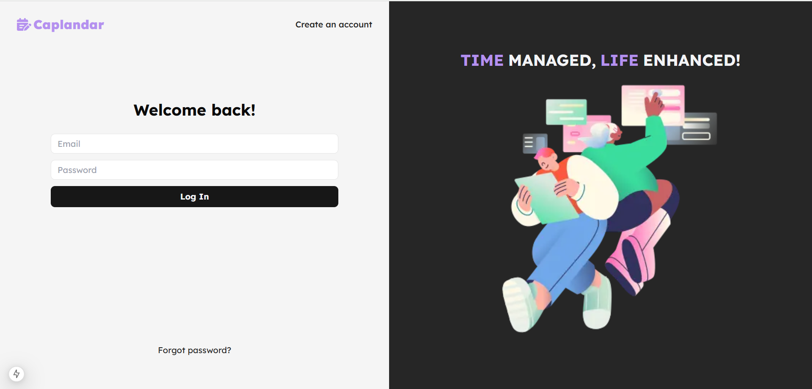
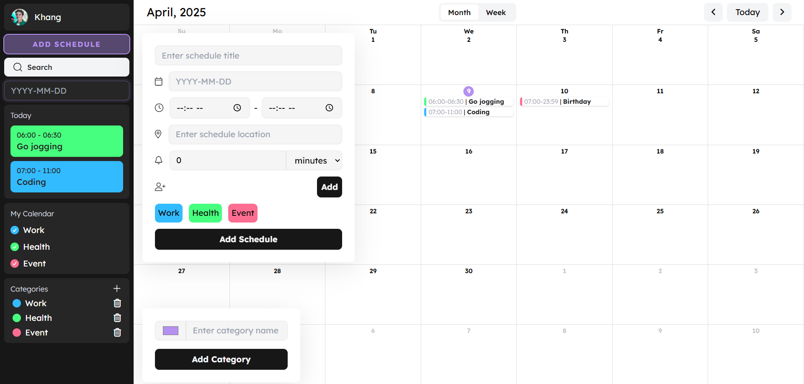
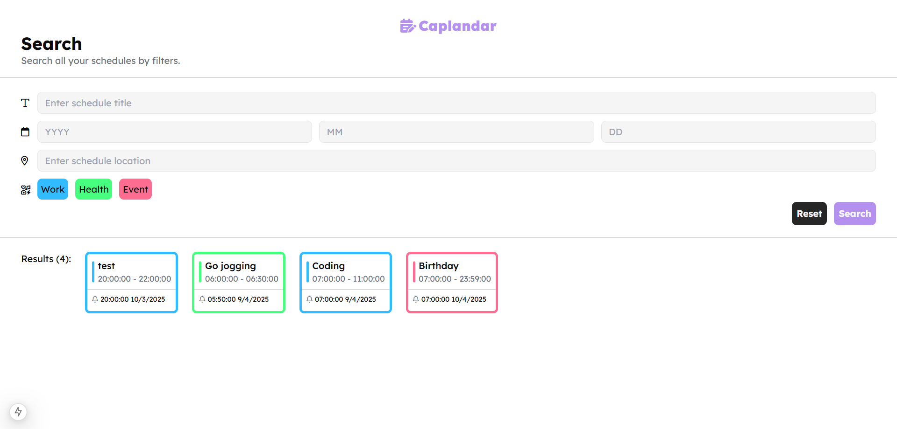
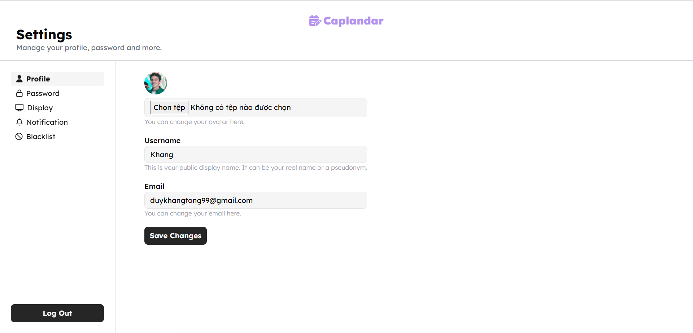

# Caplandar - Smart Calendar Management System

A modern calendar application built with Next.js, TailwindCSS, Spring Boot, and MySQL. Manage schedules, set reminders, and organize events effortlessly.

## ✨ Features

### User Management

- **Authentication**: Secure login/register with email & password
- **Profile Customization**:
  - Update username, email, and avatar
  - Manage notification preferences
  - Password reset functionality

### Calendar Features

- **Schedule Management**:
  - Create events with time slots (e.g., `06:00 - 06:30 Go jogging`)
  - Monthly calendar view with grid layout
- **Category Management**:
  - Personalize calendar with your own categories
  - Categorize your schedules limitlessly
- **Smart Search**:
  - Filter events by date, title, location, and category
  - Reset filters with one click
- **Dashboard Overview**:
  - Today's schedule preview
  - Category-based event organization
  - Quick-add functionality
- **Notify schedules by sending emails**

## 🛠 Tech Stack

**Frontend**:

- Next.js 15 (App Router)
- TailwindCSS + shadcn/UI

**Backend**:

- Spring Boot 3.2
- Spring Security (JWT Authentication)
- Spring Data JPA
- MySQL 8.0

## 📸 Application Screens

**Log in**



**Dashboard**



**Search**



**Settings**



## 🚀 Getting Started

### Prerequisites

- Node.js 18+
- Java 17
- MySQL 8.0

### Installation

1. **Clone Repository**

```bash
git clone https://github.com/khangtong/caplandar.git
cd caplandar
```

2. **Backend Setup (IntelliJ IDEA)**

- Install dependencies
- Run the backend application

3. **Frontend Setup**

```bash
cd frontend
npm install
npm run dev
```
